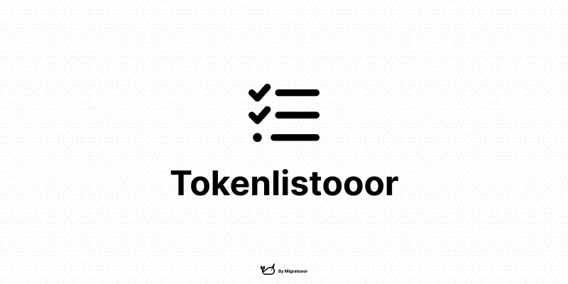

# Tokenlistooor

### A quick history
Two years ago, Uniswap launched the [Original Token Lists](https://tokenlists.org/) project. It was described as a community-driven initiative to improve the discoverability, reputation, and trustworthiness of ERC20 token lists in a manner that is inclusive, transparent, and decentralized.

Although widely used, this project has been neglected on the updates side, resulting in its current state of either death or near death: 
- Spam-ridden ([cf1](https://github.com/Uniswap/token-lists/issues), [cf2](https://github.com/Uniswap/tokenlists-org/issues)).
- Outdated (some lists have not been updated for two years).
- Broken (some lists are no longer functional).

It's difficult to assign blame for this project's woes. One of the hallmarks of open source is that anyone can contribute when they feel something is wrong. Moreover, for those of us who have had to work with these lists and build token lists, maintaining them, or even just computing the tokens in the desired format, is an extra task we'd rather not do.

These lists are great resources for token discovery, scripts and apps, but their reliability is currently questionable.

### Introducing Tokenlistooor!
Tokenlistooor is a fork of the Uniswap project with a focus on automation and some extra features:
- **⚙ One Project, One File, One Automatic Generation**: All lists are generated via the Generator script, using either the project API, the project official TokenList or directly via some SmartContract Interactions. No more manual work!
- **📝 Automatic versioning**: All lists are updated based on a Patch/Minor/Major version, where a Patch means an edit, a Minor an addition and a Major a deletation. With Tokenlistooor, no need to worry, the detection and the bumping is automagic!
- **🔎 Per network lists for smaller files**: Sometime you just need a list for one network. No need to fetch all the rest, you can just access the one you want for the chain you want!
- **♻️ Auto-updates**: All the lists are regenerated every week or every time a push is made, bumping the versions and grabing the new elements! Nothing else to do!
- **🔗 Multichain support**: Support for chains 1, 10, 56, 100, 137, 250, 42161, 43114
- **🦄 Multiple A-Tier protocols**: The generators are ready for multiple projects, Coingecko, 1Inch, Paraswap, DefiLlama, Yearn, Curve, Cowswap, Uniswap, Sushiswap, Ledgers, Portals, Wido and more soon!

### How to use the generator
To start the generator, run the following command:
`go run ./generators nameOfTheList`

