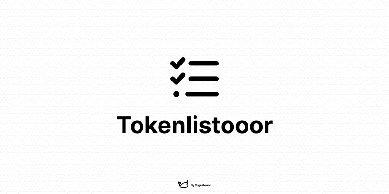

# Tokenlistooor

### A quick history

Two years ago, Uniswap launched the [Original Token Lists](https://tokenlists.org/) project. It was described as a community-driven initiative to improve the discoverability, reputation, and trustworthiness of ERC20 token lists in a manner that is inclusive, transparent, and decentralized.

Although widely used, this project has been neglected on the updates side, resulting in its current state of either death or near death:

- Spam-ridden ([cf1](https://github.com/Uniswap/token-lists/issues), [cf2](https://github.com/Uniswap/tokenlists-org/issues)).
- Outdated (some lists have not been updated for two years).
- Broken (some lists are no longer functional).

It's difficult to assign blame for this project's woes. One of the hallmarks of open source is that anyone can contribute when they feel something is wrong. Moreover, for those of us who have had to work with these lists and build token lists, maintaining them, or even just computing the tokens in the desired format, is an extra task we'd rather not do.

These lists are great resources for token discovery, scripts and apps, but their reliability is currently questionable.

### Introducing Tokenlistooor!

Tokenlistooor is a fork of the Uniswap project, with a focus on automation and some extra features. It's a one-stop shop for all your list-generation needs:

- **⚙ One Project, One File, One Automatic Generation**: Generate lists using the project API, the project official TokenList, or directly via SmartContract Interactions - no more manual work!
- **📝 Automatic Versioning**: All lists are updated automatically, based on a Patch/Minor/Major versioning system. A patch means an edit, a minor an addition, and a major a deletion - Tokenlistooor takes care of the rest!
- **🔎 Per Network Lists for Smaller Files**: Need a list for a single network? No need to fetch all the rest - just access the one you want for the chain you need!
- **♻️ Auto-Updates**: All lists are regenerated weekly or whenever a push is made, bumping the versions and grabbing the new elements - nothing else to do!
- **🔗 Multichain Support**: Supports 25+ chains, including Ethereum, Optimism, BSC, Polygon, Arbitrum, Base, Solana and more - see the full list in [docs/Chains.md](docs/Chains.md).
- **🦄 Multiple A-Tier Protocols**: Close to 40 generators are ready for projects such as Coingecko, 1Inch, Paraswap, DefiLlama, Yearn, Curve, Cowswap, Uniswap, Sushiswap, Jupiter, Portals, Bebop and more - see the full list in [docs/Generators.md](docs/Generators.md).

### How to use the generator

To start the generator, run the following command:
`go run ./generators nameOfTheList`

### Credits and Usage

- Using [1Inch](https://1inch.io/) API to generate the 1Inch Token List
- Using [Coingecko](https://www.coingecko.com/) API to generate the Coingecko Token List
- Using [Curve](https://curve.fi/) API to generate the Curve Token List
- Using [Messari](https://messari.io) API to generate the Messari Token List
- Using [Paraswap](https://www.paraswap.io/) API to generate the Paraswap Token List
- Using [Portals](https://portals.fi/) API to generate the Portals Token List
- Using [Yearn](https://yearn.fi) API to generate the Yearn Token List

By Smol
